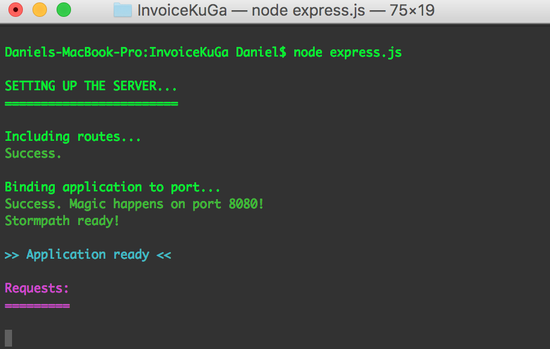
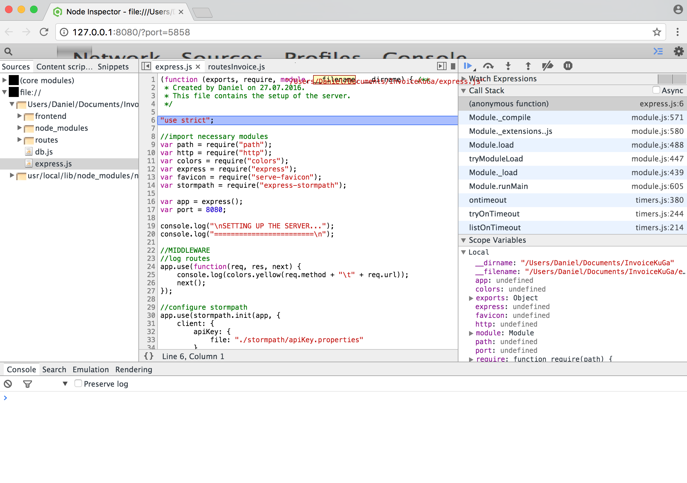

# InvoiceKuGa

The purpose of the application is to create invoices and it is possible to administer customers and customer contacts.
Furthermore, the application supports the generation of statistics and charts to analyse the revenues.

## Installation

`Node.js` needs to be installed to run the application. [Install Node.js here.](https://nodejs.org/en/download/)
After the installation has completed, run the following command:

```
npm initialize
```

This command installs all dependencies of the application which were specified in the `package.json` file.
This is what the `package.json` file looks like:

```json
{
  "name": "invoice_app_kuga",
  "version": "1.0.0",
  "description": "",
  "main": "express.js",
  "author": "Daniel Wehner",
  "license": "ISC",
  "dependencies": {
    "colors": "^1.1.2",
    "express": "^4.14.0",
    "express-stormpath": "^3.1.3",
    "html-pdf": "^2.0.1",
    "mustache": "^2.2.1",
    "pg": "^6.0.3",
    "serve-favicon": "^2.3.0"
  },
  "scripts": {
    "start": "node express.js"
  }
}
```
## Start the Application

In order to start the application, go to the root folder of the application and run the following command:

```
node express.js
```

or

```
npm start
```

The `express.js` file is the entry point of the `Node.js` application. All API endpoints are defined there and all the configuration is made there. The application now listens on port `8080`.



## API Documentation

### Customer Endpoints

GET:

- `http://<host>:<8080>/customers`:  
  Returns a list of all customers.
- `http://<host>:<8080>/customers/:id`:  
  Returns the customer with id `id`.
- `http://<host>:<8080>/customers/:id/islocked`:  
  Returns `true` if the customer with id `id` is currently locked by another user.

POST:

- `http://<host>:<8080>/customers/:id/lock`:  
  Locks the customer record with id `id`.
- `http://<host>:<8080>/customers/:id/unlock`:  
  Unlocks the customer record with id `id`.

### Invoice Endpoints

GET:

- `http://<host>:<8080>/invoices`:  
  Returns a list of all invoices.
- `http://<host>:<8080>/invoices/:id`:  
  Returns the invoice with id `id`.
- `http://<host>:<8080>/invoices/:id/print`:  
  Creates pdf for the invoice with id `id`.


### Statistics Endpoints

GET:

- `http://<host>:<8080>/statistics/revbymonth`:  
  Returns the revenue statistics grouped by months.
- `http://<host>:<8080>/statistics/revbycustomer`:  
  Returns the revenue statistics grouped by customers.

## Debugging Node.js Backend

Debugging is an integral part of the development process. For debugging a `Node.js` application it is recommended to use
the `Node Inspector` which can be installed by executing the following commad in the terminal:

```
npm install -g node-inspector
```

This installs the `Node Inspector` globally. (This is very important!) The debugger can be started like this:

```
node-debug express.js
```

After that the debugger listens on port `5858` on your local machine.
(The browser should open automatically.)



Now the application can be debugged very easily (like normal frontend `JavaScript`).
